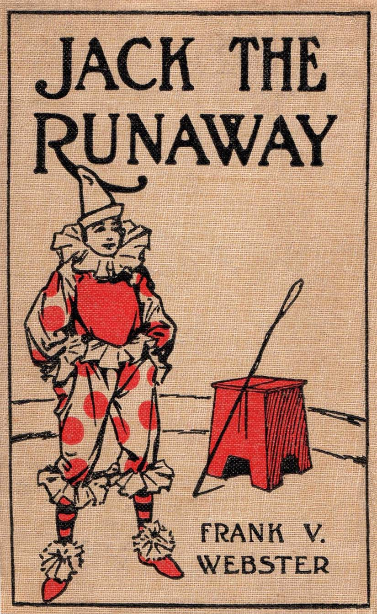

## 今回取り扱う章

**CHAPTER I**  
**JACK WANTS A DOLLAR**

チャプターの最初から途中までです。

## 全文

“Professor, will you please give me a dollar?” asked Jack Allen, of the elderly man who sat reading a book in the library.

“A dollar, Jack?” and Professor Simonedes Klopper, who had retired from the position of mathematical instructor in a large college, to devote his declining years to study, looked over the rims of his big glasses at the boy before him. “A dollar? Why, what in the world do you want of a dollar, Jack?”

“I—I want to go to a show,” and Jack rather hesitated for he was doubtful over the outcome of his request.

“A show?” and the professor’s eyes opened so wide that, seen through the powerful lenses of his glasses, they reminded Jack of the orbs of a cuttlefish.

“Yes, professor. There’s going to be a show in town to-night, and I’d like to go. All the boys will be there.”

“Does it cost a dollar to go to a—er—a performance?”

“No; not exactly. The tickets are fifty cents, but I wanted a little extra to treat some of my chums with.”

“Treat? Ah, yes, I presume you mean to furnish some sort of refreshment for your youthful companions.”

“Yes, sir. Can I have the money? I haven’t drawn all my allowance this month.”

“No; you are correct there. There is still a balance of two dollars and thirteen cents in your allowance account for this month, computing the interest at six per cent. But I shall not give you the dollar.”

“Why not?”

“Why not? Because I don’t choose to.”

## センテンス・まとまりごとの和訳と説明

“Professor, will you please give me a dollar?” asked Jack Allen, of the elderly man who sat reading a book in the library.

「教授、一ドルいただけませんか。」と、図書館で腰を下ろして本を読んでいる年嵩の男性に、Jack Allenは尋ねた。

“A dollar, Jack?” and Professor Simonedes Klopper, who had retired from the position of mathematical instructor in a large college, to devote his declining years to study, looked over the rims of his big glasses at the boy before him. “A dollar? Why, what in the world do you want of a dollar, Jack?”

「一ドルだって？Jack？」と、Simonedes Klopper教授は彼の大きな眼鏡の縁越しに、目の前の少年を見た。彼は晩年を自身の勉学に集中するために、学生の多い大学の数学講師の職を辞していた。

「一ドル？いったいなぜそれが欲しいのだ、Jack？」

declining years  
衰退する年、すなわち**晩年**となります。

large college  
この場合の*large*とは人数の多いこと、規模の大きいこと。**学生数の多い大学**を指します。

“I—I want to go to a show,” and Jack rather hesitated for he was doubtful over the outcome of his request.

“A show?” and the professor’s eyes opened so wide that, seen through the powerful lenses of his glasses, they reminded Jack of the orbs of a cuttlefish.

「ショーに行きたいんです」とJackはちょっと躊躇しながら言った。彼はお願いに対しの返答に自信が持てなかった。

「ショーだと？」と度の強い眼鏡ごしに彼は目を見開いた。その様子を見てJackはイカの眼球を連想した。

cuttlefish  
**イカ**

“Yes, professor. There’s going to be a show in town to-night, and I’d like to go. All the boys will be there.”

“Does it cost a dollar to go to a—er—a performance?”

“No; not exactly. The tickets are fifty cents, but I wanted a little extra to treat some of my chums with.”

“Treat? Ah, yes, I presume you mean to furnish some sort of refreshment for your youthful companions.”

「ええ、教授。今夜町でショーが開かれるので、それに行きたいと思います。男の子は皆ショーを見に行きます」

「うーん、公演を見るのに一ドルもかかるのか？」

「いいえ、正確には。チケットは５０セントだけど、友達と他にもちょっと楽しみたいんです」

「楽しみ？　ああわかった。友達になにかお菓子を配るつもりだろう」

chum  
**仲の良い友達。親友**

refreshment  
気分転換、回復の他に、軽食、お菓子という意味を持ちます。

“Yes, sir. Can I have the money? I haven’t drawn all my allowance this month.”

“No; you are correct there. There is still a balance of two dollars and thirteen cents in your allowance account for this month, computing the interest at six per cent. But I shall not give you the dollar.”

“Why not?”

“Why not? Because I don’t choose to.”

「ええ、教授。お金をいただけませんか。まだ全部の小遣いを使い果たしていないと思います。」

「だめだ。小遣いついてはお前の言う通り。利子を６％として計算すると、今月のお前の小遣い口座には２ドルと３０セントの残高があるだろう。しかし私はそれをお前に渡すつもりはない」

「なぜですか？」

「なぜだと？私が選ばないからだ」

balance  
預金や金銭取引の文脈では、**残高**と訳されます。

allowance  
**小遣い**

interest  
預金や金銭取引の文脈では、**利子**と訳されます。

## 単語・イディオムのおさらい

declining years  
衰退する年、すなわち**晩年**となります。

large college  
この場合の*large*とは人数の多いこと、規模の大きいこと。**学生数の多い大学**を指します。

cuttlefish  
**イカ**

chum  
**仲の良い友達。親友**

refreshment  
気分転換、回復の他に、軽食、お菓子という意味を持ちます。

balance  
預金や金銭取引の文脈では、**残高**と訳されます。

allowance  
**小遣い**

interest  
預金や金銭取引の文脈では、**利子**と訳されます。

## 全文と和訳の併記

“Professor, will you please give me a dollar?” asked Jack Allen, of the elderly man who sat reading a book in the library.

「教授、一ドルいただけませんか。」と、図書館で腰を下ろして本を読んでいる年嵩の男性に、Jack Allenは尋ねた。

“A dollar, Jack?” and Professor Simonedes Klopper, who had retired from the position of mathematical instructor in a large college, to devote his declining years to study, looked over the rims of his big glasses at the boy before him. “A dollar? Why, what in the world do you want of a dollar, Jack?”

「一ドルだって？Jack？」と、Simonedes Klopper教授は彼の大きな眼鏡の縁越しに、目の前の少年を見た。彼は晩年を自身の勉学に集中するために、学生の多い大学の数学講師の職を辞していた。

「一ドル？いったいなぜそれが欲しいのだ、Jack？」

“I—I want to go to a show,” and Jack rather hesitated for he was doubtful over the outcome of his request.

“A show?” and the professor’s eyes opened so wide that, seen through the powerful lenses of his glasses, they reminded Jack of the orbs of a cuttlefish.

「ショーに行きたいんです」とJackはちょっと躊躇しながら言った。彼はお願いに対しの返答に自信が持てなかった。

「ショーだと？」と度の強い眼鏡ごしに彼は目を見開いた。その様子を見てJackはイカの眼球を連想した。

“Yes, professor. There’s going to be a show in town to-night, and I’d like to go. All the boys will be there.”

“Does it cost a dollar to go to a—er—a performance?”

“No; not exactly. The tickets are fifty cents, but I wanted a little extra to treat some of my chums with.”

“Treat? Ah, yes, I presume you mean to furnish some sort of refreshment for your youthful companions.”

「ええ、教授。今夜町でショーが開かれるので、それに行きたいと思います。男の子は皆ショーを見に行きます」

「うーん、公演を見るのに一ドルもかかるのか？」

「いいえ、正確には。チケットは５０セントだけど、友達と他にもちょっと楽しみたいんです」

「楽しみ？　ああわかった。友達になにかお菓子を配るつもりだろう」

“Yes, sir. Can I have the money? I haven’t drawn all my allowance this month.”

“No; you are correct there. There is still a balance of two dollars and thirteen cents in your allowance account for this month, computing the interest at six per cent. But I shall not give you the dollar.”

“Why not?”

“Why not? Because I don’t choose to.”

「ええ、教授。お金をいただけませんか。まだ全部の小遣いを使い果たしていないと思います。」

「だめだ。小遣いついてはお前の言う通り。利子を６％として計算すると、今月のお前の小遣い口座には２ドルと３０セントの残高があるだろう。しかし私はそれをお前に渡すつもりはない」

「なぜですか？」

「なぜだと？私が選ばないからだ」

## 終わりに

Good job（お疲れ様です）。  
次は*CHAPTER I*の続きを取り扱います。