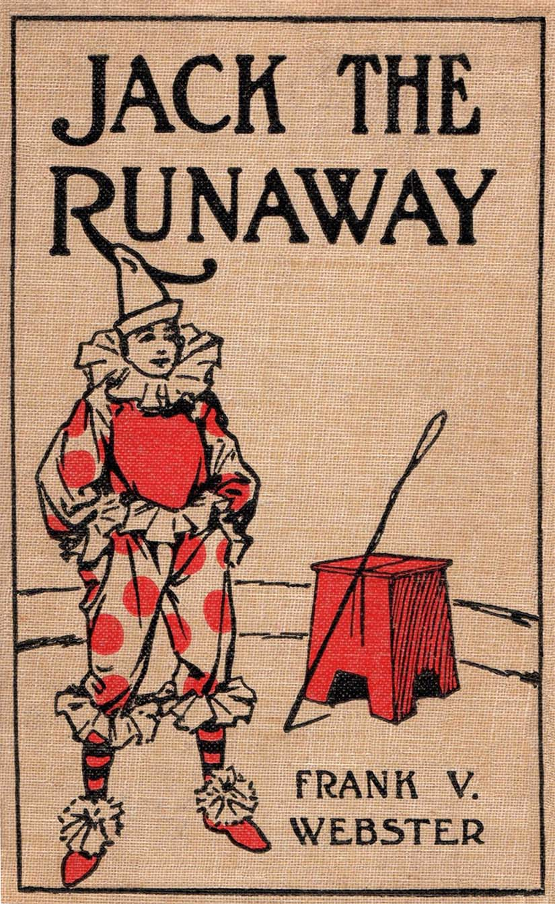

## 今回取り扱う章

**CHAPTER I**  
**JACK WANTS A DOLLAR**

チャプターの途中のテキストを取り扱います（チャプターはまだ続きます）。  

[プロジェクトグーテンベルグの原文はこちら](https://www.gutenberg.org/files/68413/68413-h/68413-h.htm)

## 前回までのあらすじ

Jackと教授の問答が続いています。   
教授はJackの素行が悪ければ、中国に滞在中の両親に連絡すると言っています。

## 全文

“You were going to.”

“I was going to say if you didn’t give me the dollar I’d go to the show anyhow.”

“How can you go if you have no money?”

“I’ll find a way. Please, Professor Klopper, advance me a dollar from my allowance that dad left with you for me.”

“Not one penny for such a frivolous use as that,” replied the professor firmly. “Now let me hear no more about it.”

“Well, I’m going!” fired back Jack. “I’m bound to see that show, and have a good time once in a while.”

“That will do!” cried the professor so sharply that Jack was startled. “Go to your room at once. I will deal with you later. I never inflict any punishment when I am angry, and you have very nearly made me so. I will attend to your case later. Go to your room at once!”

There was no choice but to obey. Slowly Jack left the library, and mounted the stairs to his own apartment. His heart was bitter, and he was not a little worried concerning his father and mother, for, since Mr. and Mrs. Sylvester Allen had reached China, on their trip around the world, news had been received that there had been serious uprisings against the “foreign devils” as the Mongolians call people not of their race.

Jack Allen, who was a bright, sturdy youth, of about sixteen years, lived in the town of Westville, in one of our Eastern States. He was an only child, and his parents were well off.

Mr. Allen was very fond of travel, and so was his wife, but they had had little chance to gratify their tastes. A short time before this story opens Mr. Allen’s firm had some business to transact abroad, in several countries. Mr. Allen was offered the chance to go, and, as it was a long-awaited opportunity he decided to take his wife, and, while they were about it, make a tour of the world.

Jack begged hard to be allowed to go, but, as it would have broken up his schooling, and as his father wanted him to become an electrical engineer, he was, much against his will, left at home.

Jack attended the Westville Academy, and was one of the best students in that institution. When his parents decided to make their long trip, they discussed several plans of having their son taken care of while they were away. Finally they decided to send him to live with a former college instructor, Professor Klopper, who was an eminent authority on many subjects.

The professor was a bachelor, and, with an elderly sister, lived in a somewhat gloomy house on the outskirts of Westville.

There Jack had been for about a year, attending school in the meanwhile.

## センテンス・まとまりごとの和訳と説明

“You were going to.”

“I was going to say if you didn’t give me the dollar I’d go to the show anyhow.”

“How can you go if you have no money?”

“I’ll find a way. Please, Professor Klopper, advance me a dollar from my allowance that dad left with you for me.”

「そう（教授を脅そうと）しようとしただろう」

「一ドルくれないなら、なんとしてもショーに行こうとすると言っただけです」

「お金もなしに、どうやって行くのだ」

「なんとかします。教授、お願いです、父さんが残してくれた小遣いから一ドルをください」

<!-- look here  
**いいですか、聞いてください**という呼びかけの意

in a good while  
**しばらくの間**という期間を表します。 -->

“Not one penny for such a frivolous use as that,” replied the professor firmly. “Now let me hear no more about it.”

“Well, I’m going!” fired back Jack. “I’m bound to see that show, and have a good time once in a while.”

“That will do!” cried the professor so sharply that Jack was startled. “Go to your room at once. I will deal with you later. I never inflict any punishment when I am angry, and you have very nearly made me so. I will attend to your case later. Go to your room at once!”

「そんなばかげた使い道には一ペニーも貸さん」と教授はかたくなに答えた。「もうこれ以上そんなことに関わることは何も聞いてくれるな」

「でも、行きますよ！」とJackは勢いよく返した。「僕は絶対にショーに行って、しばらく楽しむんだ」

「それでいい！」教授はあまりにも鋭く叫んだので、Jackはびっくりしてしまった。「すぐに部屋にいけ。後で相手をしてやる。私は怒ったときでも罰など与えないが、お前はあやうくそうさせるところだった。後で話を聞いてやろう。今は部屋に行くのだ！」

frivolous  
**ばかげた、軽薄な**

startled  
**びっくりする**

inflict a punishment  
**罰を与える**

There was no choice but to obey. Slowly Jack left the library, and mounted the stairs to his own apartment. His heart was bitter, and he was not a little worried concerning his father and mother, for, since Mr. and Mrs. Sylvester Allen had reached China, on their trip around the world, news had been received that there had been serious uprisings against the “foreign devils” as the Mongolians call people not of their race.

Jack Allen, who was a bright, sturdy youth, of about sixteen years, lived in the town of Westville, in one of our Eastern States. He was an only child, and his parents were well off.

Mr. Allen was very fond of travel, and so was his wife, but they had had little chance to gratify their tastes. A short time before this story opens Mr. Allen’s firm had some business to transact abroad, in several countries. Mr. Allen was offered the chance to go, and, as it was a long-awaited opportunity he decided to take his wife, and, while they were about it, make a tour of the world.

彼には従うより他に無かった。ゆっくりとJackは書斎を出て、自分のアパートの階段を登っていった。苦々しい思いが心によぎり、同時に両親のことがちょっと心配になった。Sylvester Allen夫妻が世界一周の旅路の途中で中国に着いたとき、「外国の悪魔たち」（モンゴル人たちが異なる人種の人間をそう呼ぶのだが）に対する大きな反乱が起きているというニュースが入ってきたからだ。

Jack Allenは、賢くたくましい１６歳の少年で、東部の州に位置するWestvilleという町に住んでいた。彼は一人っ子で、両親は裕福であった。

Allenさんと彼の妻は旅行好きで、しかし、なかなかその趣味を満足させる機会は訪れなかった。この話が始まる少し前、Allenさんの会社はいくつかの国と海外で取引をすることになった。Allenさんは海外に行く機会を得た。そして、それは彼とその妻がずっと待っていたことだったので、妻を連れて海外に発ち、ついでに世界一周をすることにした。

uprising  
**反乱**

sturdy  
**丈夫な。たくましい**

well off  
**裕福な。富裕層の**

fond of  
**～を好んでいる。～が好き**

Jack begged hard to be allowed to go, but, as it would have broken up his schooling, and as his father wanted him to become an electrical engineer, he was, much against his will, left at home.

Jack attended the Westville Academy, and was one of the best students in that institution. When his parents decided to make their long trip, they discussed several plans of having their son taken care of while they were away. Finally they decided to send him to live with a former college instructor, Professor Klopper, who was an eminent authority on many subjects.

The professor was a bachelor, and, with an elderly sister, lived in a somewhat gloomy house on the outskirts of Westville.

There Jack had been for about a year, attending school in the meanwhile.

Jackも行きたいと懇願したけれども、彼の学業に支障をきたす（父親は彼を電子技師に育てたかったので）という判断から、Allenさんは同行に反対し、Jackを家に置いておくことにした。

JackはWestvilleの学校に入学し、そこで優秀な生徒の一人となった。両親は、長期の旅行に出ると決めたとき、不在の間に息子の世話をしてもらうにはどうするかということについていくつかのプランを練った。結局、彼らは、多くの分野で著名な権威である、元大学教授のKlopper教授に預けることに決めたのだった。

教授は独身で、姉と一緒に、Westville郊外のちょっと陰鬱な感じの家に住んでいた。

Jackは学校に通いながら、その家で一年ほど暮らしていた。

eminent  
**著名な。有名な。優れている**

former  
**元〇〇**の意味。*former college instructor*で元大学教授を指す。

## 単語・イディオムのおさらい

frivolous  
**ばかげた、軽薄な**

startled  
**びっくりする**

inflict a punishment  
**罰を与える**

uprising  
**反乱**

sturdy  
**丈夫な。たくましい**

well off  
**裕福な。富裕層の**

fond of  
**～を好んでいる。～が好き**

eminent  
**著名な。有名な。優れている**

former  
**元〇〇**の意味。*former college instructor*で元大学教授を指す。

## 全文と和訳の併記

“You were going to.”

“I was going to say if you didn’t give me the dollar I’d go to the show anyhow.”

“How can you go if you have no money?”

“I’ll find a way. Please, Professor Klopper, advance me a dollar from my allowance that dad left with you for me.”

「そう（教授を脅そうと）しようとしただろう」

「一ドルくれないなら、なんとしてもショーに行こうとすると言っただけです」

「お金もなしに、どうやって行くのだ」

「なんとかします。教授、お願いです、父さんが残してくれた小遣いから一ドルをください」

“Not one penny for such a frivolous use as that,” replied the professor firmly. “Now let me hear no more about it.”

“Well, I’m going!” fired back Jack. “I’m bound to see that show, and have a good time once in a while.”

“That will do!” cried the professor so sharply that Jack was startled. “Go to your room at once. I will deal with you later. I never inflict any punishment when I am angry, and you have very nearly made me so. I will attend to your case later. Go to your room at once!”

「そんなばかげた使い道には一ペニーも貸さん」と教授はかたくなに答えた。「もうこれ以上そんなことに関わることは何も聞いてくれるな」

「でも、行きますよ！」とJackは勢いよく返した。「僕は絶対にショーに行って、しばらく楽しむんだ」

「それでいい！」教授はあまりにも鋭く叫んだので、Jackはびっくりしてしまった。「すぐに部屋にいけ。後で相手をしてやる。私は怒ったときでも罰など与えないが、お前はあやうくそうさせるところだった。後で話を聞いてやろう。今は部屋に行くのだ！」

There was no choice but to obey. Slowly Jack left the library, and mounted the stairs to his own apartment. His heart was bitter, and he was not a little worried concerning his father and mother, for, since Mr. and Mrs. Sylvester Allen had reached China, on their trip around the world, news had been received that there had been serious uprisings against the “foreign devils” as the Mongolians call people not of their race.

Jack Allen, who was a bright, sturdy youth, of about sixteen years, lived in the town of Westville, in one of our Eastern States. He was an only child, and his parents were well off.

Mr. Allen was very fond of travel, and so was his wife, but they had had little chance to gratify their tastes. A short time before this story opens Mr. Allen’s firm had some business to transact abroad, in several countries. Mr. Allen was offered the chance to go, and, as it was a long-awaited opportunity he decided to take his wife, and, while they were about it, make a tour of the world.

彼には従うより他に無かった。ゆっくりとJackは書斎を出て、自分のアパートの階段を登っていった。苦々しい思いが心によぎり、同時に両親のことがちょっと心配になった。Sylvester Allen夫妻が世界一周の旅路の途中で中国に着いたとき、「外国の悪魔たち」（モンゴル人たちが異なる人種の人間をそう呼ぶのだが）に対する大きな反乱が起きているというニュースが入ってきたからだ。

Jack Allenは、賢くたくましい１６歳の少年で、東部の州に位置するWestvilleという町に住んでいた。彼は一人っ子で、両親は裕福であった。

Allenさんと彼の妻は旅行好きで、しかし、なかなかその趣味を満足させる機会は訪れなかった。この話が始まる少し前、Allenさんの会社はいくつかの国と海外で取引をすることになった。Allenさんは海外に行く機会を得た。そして、それは彼とその妻がずっと待っていたことだったので、妻を連れて海外に発ち、ついでに世界一周をすることにした。

Jack begged hard to be allowed to go, but, as it would have broken up his schooling, and as his father wanted him to become an electrical engineer, he was, much against his will, left at home.

Jack attended the Westville Academy, and was one of the best students in that institution. When his parents decided to make their long trip, they discussed several plans of having their son taken care of while they were away. Finally they decided to send him to live with a former college instructor, Professor Klopper, who was an eminent authority on many subjects.

The professor was a bachelor, and, with an elderly sister, lived in a somewhat gloomy house on the outskirts of Westville.

There Jack had been for about a year, attending school in the meanwhile.

Jackも行きたいと懇願したけれども、彼の学業に支障をきたす（父親は彼を電子技師に育てたかったので）という判断から、Allenさんは同行に反対し、Jackを家に置いておくことにした。

JackはWestvilleの学校に入学し、そこで優秀な生徒の一人となった。両親は、長期の旅行に出ると決めたとき、不在の間に息子の世話をしてもらうにはどうするかということについていくつかのプランを練った。結局、彼らは、多くの分野で著名な権威である、元大学教授のKlopper教授に預けることに決めたのだった。

教授は独身で、姉と一緒に、Westville郊外のちょっと陰鬱な感じの家に住んでいた。

Jackは学校に通いながら、その家で一年ほど暮らしていた。

## 終わりに

Good job（お疲れ様です）。  
次は引き続き*CHAPTER I*の続きを取り扱います。
